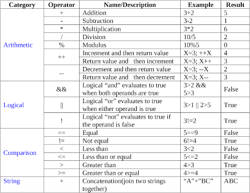
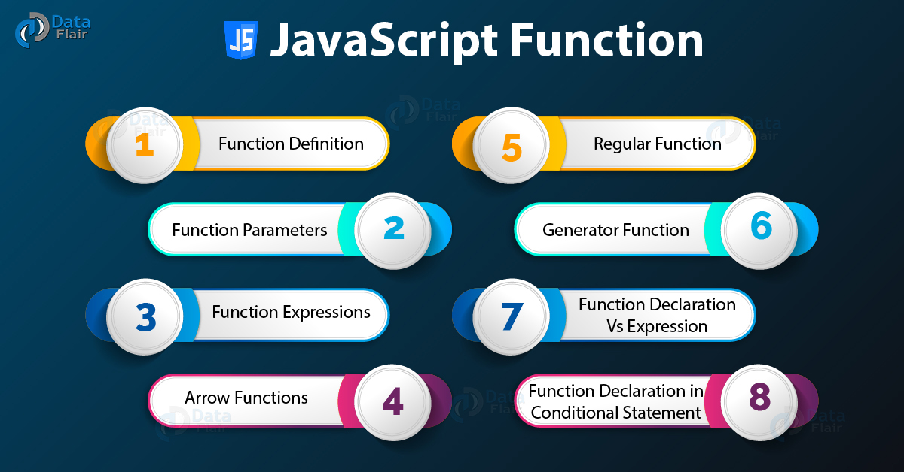
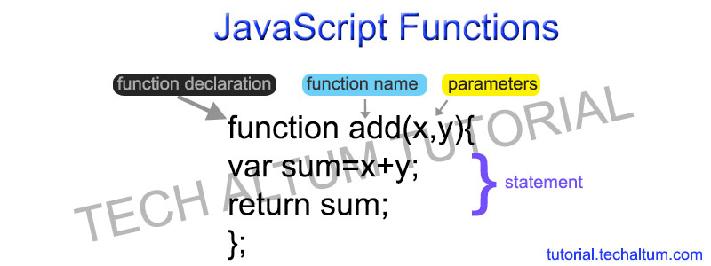

# **THE ABC OF PROGRAMMING**
### Before you learn how to read and write the JavaScript language itself, you need to become familiar with some key concepts in computer programming. They will be covered in three section

* ## A

What is a script and how do I create one?

* ## B

How do computers fit in with the world around them?

* ## C

How do I write a script for a web page?

# **EXPRESSIONS**
**What is a JavaScript Expression?**
## *an expression is a snippet of code that evaluates to a value. A statement is a snippet of code that performs an action. Wherever JavaScript expects a statement, you can write an expression. But the opposite isn't true: if a framework or the JavaScript runtime expects an expression, you cannot use a statement*.

## In JavaScript there are four types of expressions:
In JavaScript there are four types of expressions:
* Assignment expression 

* Arithmetic expression: Expressions in which arithmetic operations are performed arecalled arithmetic expression.Example: netPrice=1200+12
* String expression : Expressions in which operations are performed on string arecalled string expression.Example: mesg= "Hello," + "Mr. Rakesh", Here "+" string operatorconcatenate two strings "Hello, " and "Mr. Rakesh" results "Hello,Mr. Rakesh" that is assigned to variable mesg.

* Logical expression : These expressions evaluate to a Boolean (true or false) value.Example: 10<19, since 10<19, this expression evaluates to theBoolean value of true.
* Assignment expression

# **JavaScript Functions**
## A JavaScript function is a block of code designed to perform a particular task.
A JavaScript function is executed when "something" invokes it (calls it).
* Function parameters are listed inside the parentheses () in the function definition.
* Function arguments are the values received by the function when it is invoked

