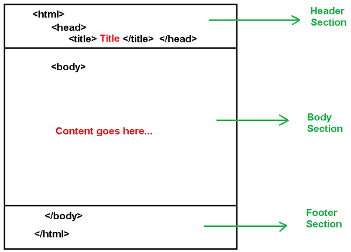
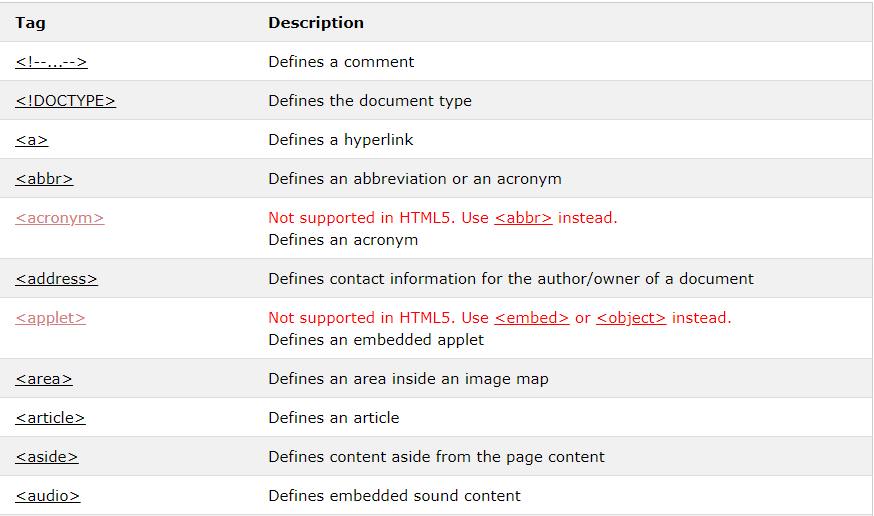
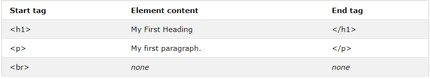
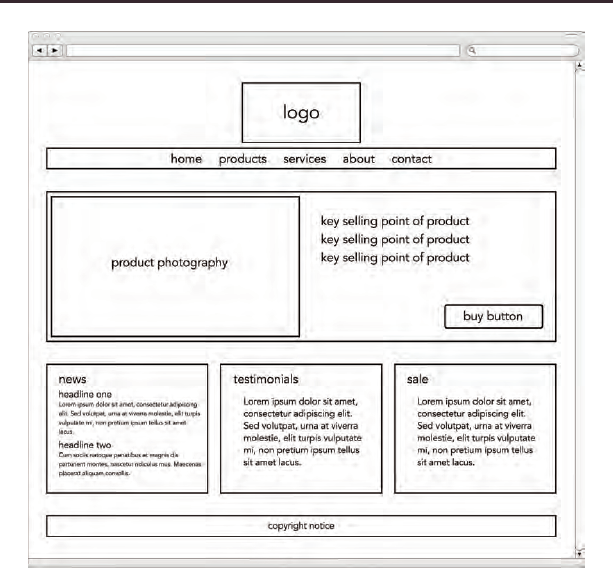

# Html 
### **What is HTML?**

#### HTML is the standard markup language for Web pages.
#### With HTML you can create your own Website.
### **What is an HTML Element?**
#### Body, Head & Title 

* body : You met the body element.Everything inside this element isshown inside the main browserwindow.
* head : Before the body element you will often see ahead element. This contains information about the page (rather than information that is shown within the main part of the browser window that is highlighted in blue on the opposite page). You will usually find a title element inside the head element.
* title : The contents of the title element are either shown in the top of the browser, above where you usually type in the URL of the page you want to visit, or on the tab for that page (if your browser uses tabs to allow you to view multiple
# Website design
## It is very important when designing websites and before starting to define and plan some requirements before starting
# Including:
* It is the target group that is important to know to determine the method of attraction through the external appearance
* And the goals of the site are why people visit it
* What service does it provide
* And what this group needs and what they need to reach
**This information helps guide your design and is a must-know**
## **And you should ask yourself some questions:**
* What is the idea of your site?
* What is the content of the site?
* What is Wireframe?
* What is the target group?
* What are the colors, shapes, and everything related to the external * appearance of the site?
* What is planned for this idea and planning for it and then start with it!
# some tags can help 

# some elemnts 

# look for example in wireframe

