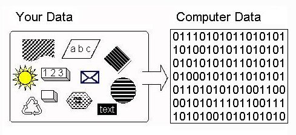

# **What is a computer?**
## *A computer is an electronic device that manipulates information, or data. It has the ability to store, retrieve, and process data. You may already know that you can use a computer to type documents, send email, play games, and browse the Web. You can also use it to edit or create spreadsheets, presentations, and even videos*.

# **Hardware vs. software**
* **Hardware** is any part of your computer that has a physical structure, such as the keyboard or mouse. It also includes all of the computer's internal parts, which you can see in the image below.
* **Software** is any set of instructions that tells the hardware what to do and how to do it. Examples of software include web browsers, games, and word processors.
*look for hardware*

*look for software*

# **What does Binary Data mean?**
## Binary data is a type of data that is represented or displayed in the binary numeral system. Binary data is the only category of data that can be directly understood and executed by a computer. It is numerically represented by a combination of zeros and ones.

# **What are logic gates? Circuits that compare!**
### A logic gate might sound horribly complex, but it's simply an electric circuit with two inputs and an output. It receives two incoming electric currents, compares them, and sends on a new, outgoing electric current depending on what it finds. A logic gate is a bit like a doorman or bouncer who is allowed to let people into a nightclub only if they pass certain tests. There are quite a few different types of logic gate, the most common of which are called AND, OR, NOT, XOR (Exclusive Or), NAND (NOT AND), and NOR (NOT OR). Let's look at the three simpler ones, AND, OR, and NOT:
* AND

* OR

* NOT

# **CPU, Memory, Input & Output**

